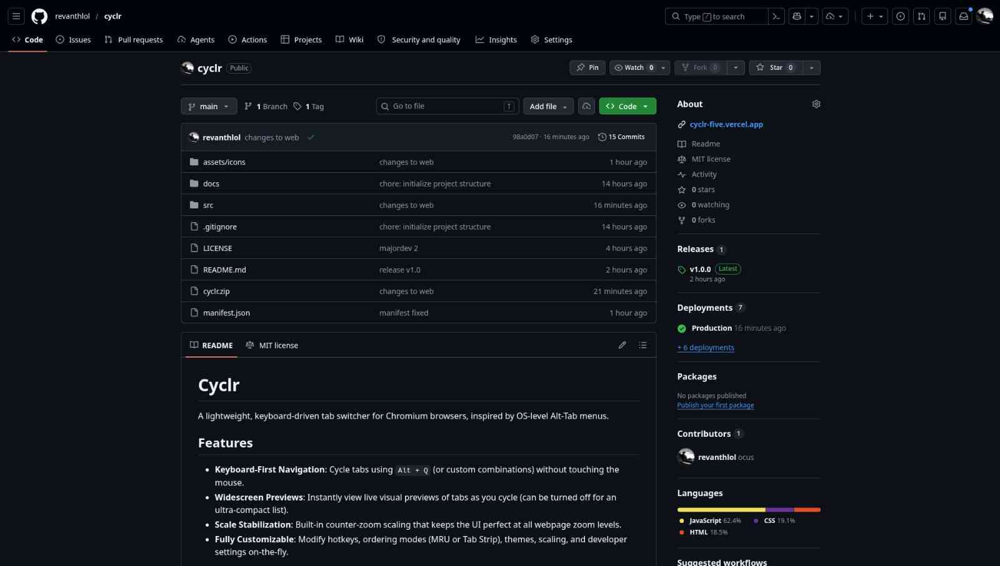

# Cyclr

A lightweight, keyboard-driven tab switcher for Chromium browsers, inspired by OS-level Alt-Tab menus.

 

  

    
    
    
  

  

    
    

      

        
        GitHub — revanthlol/cyclr
      

      

        
        Cyclr — Minimal Tab Switcher
      

      

        
        WhatsApp Web
      

      

        
        Google Search — tab switcher for chrome
      

    

  

 

**→ [cyclr landing page](https://revanthlol.github.io/cyclr/src/web/)** &nbsp;|&nbsp; **[manual install guide](https://revanthlol.github.io/cyclr/src/web/install.html)** &nbsp;|&nbsp; **[latest release](https://github.com/revanthlol/cyclr/releases/latest)**

## Features

- **Keyboard-First Navigation**: Cycle tabs using `Alt + Q` (or custom combinations) without touching the mouse.
- **Widescreen Previews**: Instantly view live visual previews of tabs as you cycle (can be turned off for an ultra-compact list).
- **Scale Stabilization**: Built-in counter-zoom scaling that keeps the UI perfect at all webpage zoom levels.
- **Fully Customizable**: Modify hotkeys, ordering modes (MRU or Tab Strip), themes, scaling, and developer settings on-the-fly.

## Controls

- **Open**: Hold <kbd>Alt</kbd> and tap <kbd>Q</kbd> (default).
- **Cycle Down**: Tap <kbd>Q</kbd>, <kbd>ArrowDown</kbd>, or <kbd>Tab</kbd>.
- **Cycle Up**: Tap <kbd>ArrowUp</kbd> or <kbd>Shift + Tab</kbd>.
- **Commit**: Release <kbd>Alt</kbd> (or the active modifier key), or press <kbd>Enter</kbd>.
- **Cancel**: Press <kbd>Escape</kbd>.

## Installation

The extension isn't on the [Chrome Web Store](https://chrome.google.com/webstore/category/extensions) yet. Install it manually:

1. Download the latest [`cyclr.zip`](https://github.com/revanthlol/cyclr/releases/latest/download/cyclr.zip) from the [releases page](https://github.com/revanthlol/cyclr/releases), or clone this [repository](https://github.com/revanthlol/cyclr).
2. Open Chrome/Chromium and go to `chrome://extensions`.
3. Enable **Developer mode** (top-right toggle).
4. Click **Load unpacked** and select the unzipped folder (or the repo root).
5. Done — configure preferences via the extension's options page.

> See the **[full step-by-step install guide](https://revanthlol.github.io/cyclr/src/web/install.html)** for screenshots and detailed instructions.

## Known Limitations

- **Restricted pages**: Cyclr cannot run on Chrome's internal or privileged pages (`chrome://*`, New Tab, Web Store, DevTools, other extension pages, or `chrome-extension://*`) due to browser security restrictions. `file://` support requires manual permission, while contexts like the PDF viewer or `data:` URLs may work with limitations due to iframe isolation.

- **Iframes**: The overlay is intentionally suppressed inside iframes to prevent duplicate instances. If a page is loaded entirely inside a frame (some embedded dashboards, web apps), the overlay may not trigger.

- **Custom shortcut recording is experimental**: The shortcut recorder works reliably for standard letter/number combos with `Alt` or `Ctrl` modifiers, but has known issues with symbol keys (`` ` ``, `-`, `=`, etc.) on Linux due to how Xorg/Wayland handles modifier+key combinations in browsers — `e.key` can return `"Dead"` or `"Unidentified"` instead of the actual character. **Stick with the default `Alt + Q`** unless you're comfortable debugging storage values manually. A proper fix is planned.

- **MRU ordering depends on focus events**: The Most Recently Used tab order is tracked via Chrome's `tabs.onActivated` API. Tabs that were active before the extension was installed won't have accurate MRU history until they're visited at least once after install.

## License

This project is open-source under the [MIT License](LICENSE).
