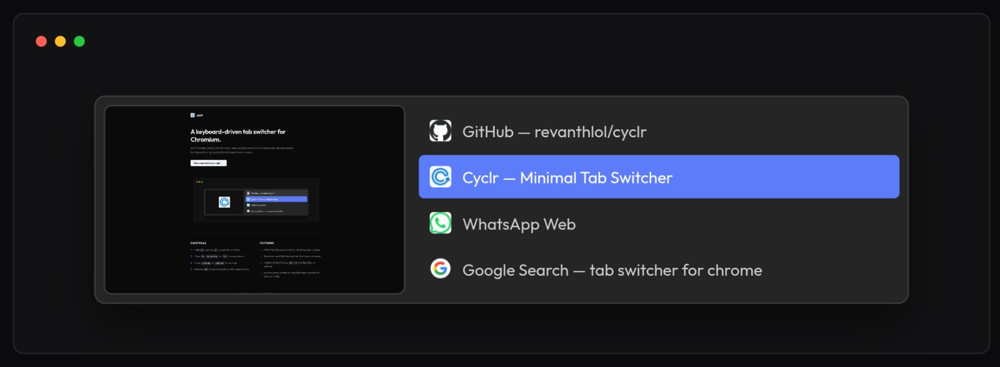

# Cyclr

A lightweight, keyboard-driven tab switcher for Chromium and Firefox browsers, inspired by OS-level Alt-Tab menus.

## Screenshots

**[Visit the website](https://cyclrr.vercel.app/)** • **[Download the latest release](https://github.com/revanthlol/cyclr/releases/latest/download/cyclr.zip)**

## Features

- **Keyboard-First Navigation**: Cycle tabs using `Alt + Q` (or custom combinations) without touching the mouse.
- **Widescreen Previews (Default)**: Instantly view live visual previews of tabs as you cycle (can be switched to a list or grid layout).
- **High-Quality Favicon Previews & Preloading**: Chrome tab previews show sharp, high-fidelity favicons before a screenshot is cached, preloaded in the background for zero-delay rendering.
- **Close Tabs Directly**: Red close tab buttons allow closing tabs directly from the preview list or grid card interface without leaving the switcher.
- **Scale Stabilization**: Built-in counter-zoom scaling that keeps the UI perfect at all webpage zoom levels.
- **Fully Customizable**: Modify hotkeys, ordering modes (MRU or Tab Strip), themes, scaling, and developer settings on-the-fly.

## Controls

- **Open**: Hold <kbd>Alt</kbd> and tap <kbd>Q</kbd> (default).
- **Cycle Down**: Tap <kbd>Q</kbd>, <kbd>ArrowDown</kbd>, or <kbd>Tab</kbd>.
- **Cycle Up**: Tap <kbd>ArrowUp</kbd> or <kbd>Shift + Tab</kbd>.
- **Commit**: Release <kbd>Alt</kbd> (or the active modifier key), or press <kbd>Enter</kbd>.
- **Close Tab**: Press <kbd>Alt + W</kbd> (or the active modifier + <kbd>W</kbd>).
- **Cancel**: Press <kbd>Escape</kbd>.

## Installation

Install Cyclr manually:

### Chrome / Chromium-based Browsers
1. Download the latest [`cyclr.zip`](https://github.com/revanthlol/cyclr/releases/latest/download/cyclr.zip) from the [releases page](https://github.com/revanthlol/cyclr/releases), or clone this [repository](https://github.com/revanthlol/cyclr).
2. Open Chrome/Chromium and go to `chrome://extensions`.
3. Enable **Developer mode** (top-right toggle).
4. Click **Load unpacked** and select the unzipped folder (or the repo root).
5. Done — configure preferences via the extension's options page.

### Firefox
1. Download and extract the latest [`cyclr.zip`](https://github.com/revanthlol/cyclr/releases/latest/download/cyclr.zip).
2. Open Firefox and navigate to `about:debugging`.
3. Click **This Firefox** in the left sidebar.
4. Click the **Load Temporary Add-on...** button.
5. Select the `manifest.json` file inside your unzipped Cyclr folder.

> See the **[Homepage](https://cyclr-five.vercel.app/index.html)** for further details.

## Known Limitations

- **Restricted pages**: Cyclr cannot run on internal or privileged browser pages (e.g. `chrome://*`, `about:*`, browser web stores like Chrome Web Store or AMO, support pages, DevTools, or extension-specific pages) due to browser-level security restrictions. On these pages, Cyclr automatically falls back to cycling through your tabs directly.

- **Iframes**: The overlay is intentionally suppressed inside iframes to prevent duplicate instances. If a page is loaded entirely inside a frame (some embedded dashboards, web apps), the overlay may not trigger.

- **MRU ordering depends on focus events**: The Most Recently Used tab order is tracked via Chrome's `tabs.onActivated` API. Tabs that were active before the extension was installed won't have accurate MRU history until they're visited at least once after install.

## License

This project is open-source under the [MIT License](LICENSE).
